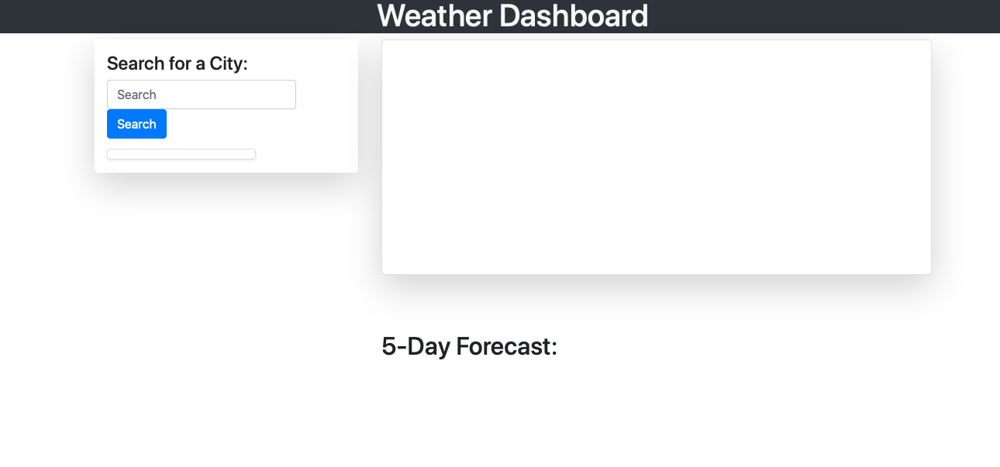
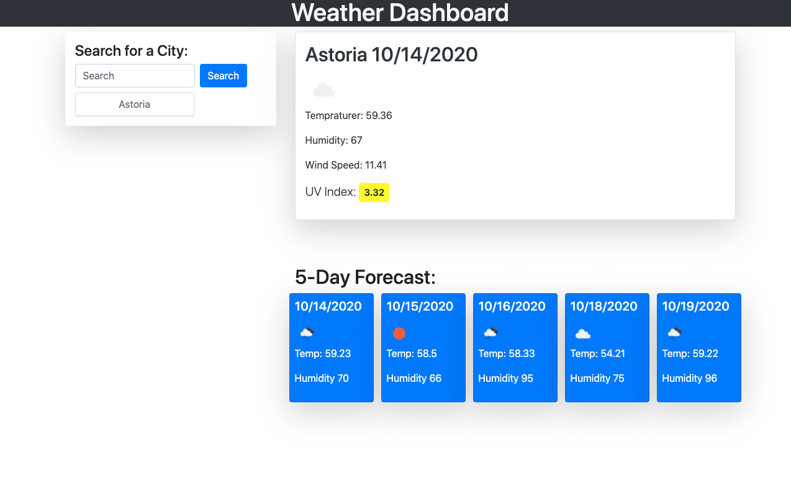
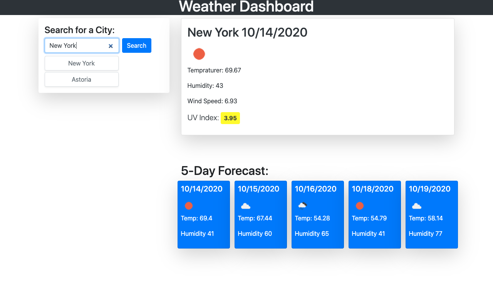

# weather-dashboard

This application allows for a user to check the daily and 5 Day Forecast of a city the user input into the search bar. The user will see the current weather, including the temperature, humidity, wind speed, and UV index in that given city. The UV Index will have a color code alerting the user if the index is low, moderate or high. Below this information the user can see the 5 Day Forecast with the temperature and humidity displayed. The user will be able to insert multiple cities and still be able to access the cities previously viewed and their information. 

This assignments difficulty, for me, really layed in what approach I wanted for the html along with which API(s) I wanted to use. The original plan was to use the current and 5 Day Forecast API, so I started my code but after some time and research I saw the One Call API and thought that would be an easier API to use. After writing out a decent amount of code I realized I preferred the other format I had better. Doing this took up a lot of time and therefore did not allow for me to finalize some aspects in the final deployed site. For example, when the user opens the site, you can see the divs for the current and 5 Day Forecast. Overall I am satisfied enough with the product I have but will go back and work on perfecting the site once I have a grade on this assignment. 

## Installation

Fork repository at [gstephboli github](https://github.com/gstephboli/weather-dashboard) .

Clone repository to local terminal.

Open HTML then open webpage to default browser.

Happy editing!

## Usage

This [website] (https://gstephboli.github.io/weather-dashboard/) allows a user to input a city and find out the current weather in that specified city like temperature, humidity, wind speed and the UV index. The user also will see a five day forecast showing the temperature and humidity each day. 

## Credits

I credit the following:

[OpenWeatherCurrentAPI] (https://openweathermap.org/current)
[OpenWeather5DayAPI] (https://openweathermap.org/forecast5)
[MomentJS] (https://momentjs.com/)
[UVIndex] (https://19january2017snapshot.epa.gov/sunsafety/uv-index-scale-1_.html#:~:text=A%20UV%20Index%20reading%20of%206%20to%207%20means%20high,%2C%20and%20UV%2Dblocking%20sunglasses.)

## Contact

####  **Stephany Bolivar** 
*  **Github:** [@gstephboli](https://github.com/gstephboli)
*  **Email:** [g.stephanybolivar@gmail.com](g.stephanybolivar@gmail.com)

## License

MIT License

Copyright (c) [2020] [Gloria Stephany Bolivar]

Permission is hereby granted, free of charge, to any person obtaining a copy
of this software and associated documentation files (the "Software"), to deal
in the Software without restriction, including without limitation the rights
to use, copy, modify, merge, publish, distribute, sublicense, and/or sell
copies of the Software, and to permit persons to whom the Software is
furnished to do so, subject to the following conditions:

The above copyright notice and this permission notice shall be included in all
copies or substantial portions of the Software.

THE SOFTWARE IS PROVIDED "AS IS", WITHOUT WARRANTY OF ANY KIND, EXPRESS OR
IMPLIED, INCLUDING BUT NOT LIMITED TO THE WARRANTIES OF MERCHANTABILITY,
FITNESS FOR A PARTICULAR PURPOSE AND NONINFRINGEMENT. IN NO EVENT SHALL THE
AUTHORS OR COPYRIGHT HOLDERS BE LIABLE FOR ANY CLAIM, DAMAGES OR OTHER
LIABILITY, WHETHER IN AN ACTION OF CONTRACT, TORT OR OTHERWISE, ARISING FROM,
OUT OF OR IN CONNECTION WITH THE SOFTWARE OR THE USE OR OTHER DEALINGS IN THE
SOFTWARE.